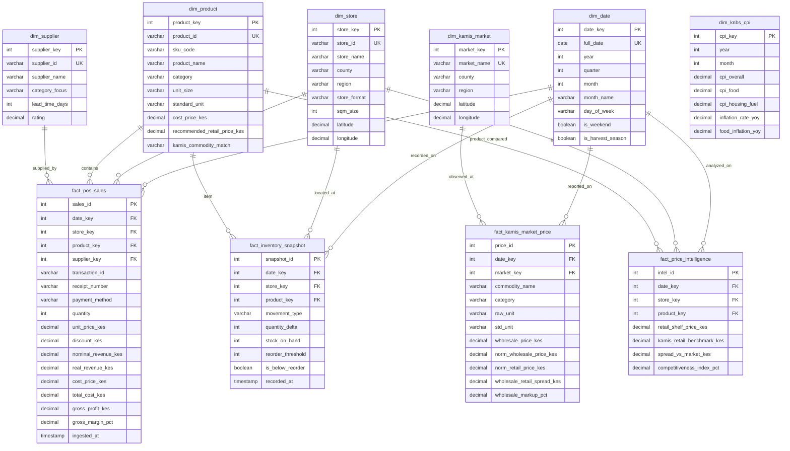

# Milestone 4: PostgreSQL Dimensional Star Schema

## 1. Dimensional Model Entity Relationship Diagram (ERD)

```mermaid
erDiagram
    dim_date ||--o{ fact_pos_sales : "occurs_on"
    dim_store ||--o{ fact_pos_sales : "originates_from"
    dim_product ||--o{ fact_pos_sales : "contains"
    dim_supplier ||--o{ fact_pos_sales : "supplied_by"

    dim_date ||--o{ fact_inventory_snapshot : "recorded_on"
    dim_store ||--o{ fact_inventory_snapshot : "located_at"
    dim_product ||--o{ fact_inventory_snapshot : "item"

    dim_date ||--o{ fact_kamis_market_price : "reported_on"
    dim_kamis_market ||--o{ fact_kamis_market_price : "observed_at"

    dim_date ||--o{ fact_price_intelligence : "analyzed_on"
    dim_store ||--o{ fact_price_intelligence : "benchmark_for"
    dim_product ||--o{ fact_price_intelligence : "product_compared"

    dim_date {
        int date_key PK
        date full_date UK
        int year
        int quarter
        int month
        varchar month_name
        varchar day_of_week
        boolean is_weekend
        boolean is_harvest_season
    }

    dim_store {
        int store_key PK
        varchar store_id UK
        varchar store_name
        varchar county
        varchar region
        varchar store_format
        int sqm_size
        decimal latitude
        decimal longitude
    }

    dim_product {
        int product_key PK
        varchar product_id UK
        varchar sku_code
        varchar product_name
        varchar category
        varchar unit_size
        varchar standard_unit
        decimal cost_price_kes
        decimal recommended_retail_price_kes
        varchar kamis_commodity_match
    }

    dim_supplier {
        int supplier_key PK
        varchar supplier_id UK
        varchar supplier_name
        varchar category_focus
        int lead_time_days
        decimal rating
    }

    dim_kamis_market {
        int market_key PK
        varchar market_name UK
        varchar county
        varchar region
        decimal latitude
        decimal longitude
    }

    dim_knbs_cpi {
        int cpi_key PK
        int year
        int month
        decimal cpi_overall
        decimal cpi_food
        decimal cpi_housing_fuel
        decimal inflation_rate_yoy
        decimal food_inflation_yoy
    }

    fact_pos_sales {
        int sales_id PK
        int date_key FK
        int store_key FK
        int product_key FK
        int supplier_key FK
        varchar transaction_id
        varchar receipt_number
        varchar payment_method
        int quantity
        decimal unit_price_kes
        decimal discount_kes
        decimal nominal_revenue_kes
        decimal real_revenue_kes
        decimal cost_price_kes
        decimal total_cost_kes
        decimal gross_profit_kes
        decimal gross_margin_pct
        timestamp ingested_at
    }

    fact_inventory_snapshot {
        int snapshot_id PK
        int date_key FK
        int store_key FK
        int product_key FK
        varchar movement_type
        int quantity_delta
        int stock_on_hand
        int reorder_threshold
        boolean is_below_reorder
        timestamp recorded_at
    }

    fact_kamis_market_price {
        int price_id PK
        int date_key FK
        int market_key FK
        varchar commodity_name
        varchar category
        varchar raw_unit
        varchar std_unit
        decimal wholesale_price_kes
        decimal norm_wholesale_price_kes
        decimal norm_retail_price_kes
        decimal wholesale_retail_spread_kes
        decimal wholesale_markup_pct
    }

    fact_price_intelligence {
        int intel_id PK
        int date_key FK
        int store_key FK
        int product_key FK
        decimal retail_shelf_price_kes
        decimal kamis_retail_benchmark_kes
        decimal spread_vs_market_kes
        decimal competitiveness_index_pct
    }
```
